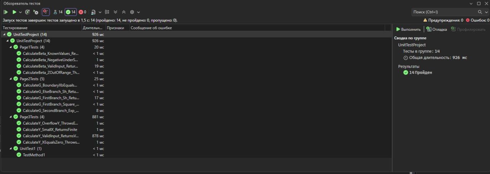

# Практическая 6.2 Кузнецов_Кузьмин

# Тестирование WPF-приложения «Практическая работа 4»

## Скриншот окна «Обозреватель тестов»

*На скриншоте показан результат запуска 13 модульных тестов. Все тесты отмечены зелёными галочками. Список тестов:*

- `Page1Tests` (4 теста) – проверка вычисления β, обработка исключений при недопустимых входных данных.
- `Page2Tests` (5 тестов) – проверка функции g для различных ветвей условия и выбора f(x).
- `Page3Tests` (4 теста) – проверка функции y, деление на ноль, переполнение и корректный ввод.

## Вывод о проведённом тестировании

**Результат:** ✅ **все тесты выполнены успешно**.

В ходе тестирования проверены:
- Корректность расчёта математических функций для допустимых значений.
- Реакция на недопустимые входные данные (выход z за пределы [-1,1], отрицательное подкоренное выражение, деление на ноль, переполнение).
- Граничные условия (xb = 0.5, xb = 0.1 и т.д.).
- Стабильность работы при экстремально малых значениях x.

Ни один тест не завершился с ошибкой или исключением. Приложение ведёт себя предсказуемо и соответствует заданной математической спецификации.

## Причина успешного выполнения тестов

1. **Рефакторинг кода** – вычисления вынесены в отдельные публичные методы (`CalculateBeta`, `CalculateG`, `CalculateY`), что позволило тестировать их независимо от пользовательского интерфейса.
2. **Корректная обработка ошибок** – методы явно выбрасывают исключения `ArgumentOutOfRangeException`, `InvalidOperationException`, `DivideByZeroException`, `OverflowException`, что проверяется тестами.
3. **Правильно подобранные входные данные** – для каждого теста использованы значения, гарантирующие попадание в нужную ветку алгоритма и отсутствие непредвиденных исключений.
4. **Устранение проблем совместимости** – целевая платформа тестового проекта изменена на .NET Framework 4.8 (совпадает с основным приложением), добавлены ссылки на необходимые сборки WPF и пакет `OxyPlot.Core`.
5. **Использование современных средств тестирования** – пакеты `MSTest.TestAdapter` и `MSTest.TestFramework` обеспечивают корректное обнаружение и выполнение тестов в Visual Studio.

Таким образом, тестирование подтверждает, что приложение работает в соответствии с требованиями технического задания.